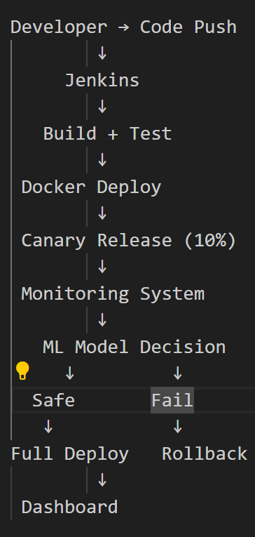
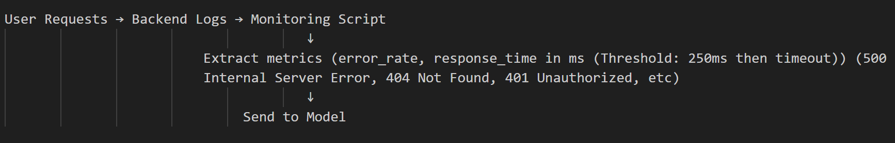

Problem Statement

Modern e-commerce platforms such as Amazon require continuous deployment of new features and updates. However, traditional CI/CD pipelines deploy changes without intelligent evaluation, leading to system failures, downtime, and poor user experience—especially during high-traffic events like sales.

Manual monitoring and rollback processes are slow and inefficient, causing increased recovery time and potential revenue loss. Additionally, existing systems lack the ability to predict failures or adapt to real-world traffic conditions.

  

Therefore, there is a need for an intelligent, automated deployment system that can:

Predict failures before full deployment
Test updates on a limited user base
Automatically rollback faulty deployments
Simulate real-world traffic conditions (we used OMNeT++ for simulation)
Ensure system reliability and minimal downtime

 

{
  "timestamp": "10:00",
  "status": "fail",
  "response_time": 1200
}